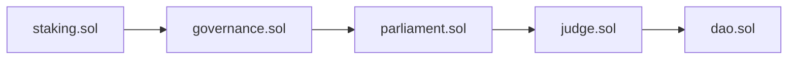

# DAO TOKEN

## ROLES

 - President
 - Ministers
 - Judge
 - Holders
 

### President

- Have to steak some tokens to be candidate.
- During the presidency, tokens remain locked.
- Can spend as much marketing budget as it locks tokens.
- Can appoint ministers.

### Ministers

- Ministers have a say in the administration together with the president.

### Judge (Inspector)

- Can oversee the president and the ministers' decisions.
- Can remove the president by voting.

### Holders

- Can elect the president and judge by voting.
- Can remove the judge by voting.

## Token Management

A completely decentralized token management system where everyone can have a say.
Faster decision making with a virtual government system.

## Voting System
All token holders can initiate voting.
Starting a vote is paid.

### Inheritance structure:

## Warning!
***The system has not been tested. It will be updated as bugs are fixed.***
